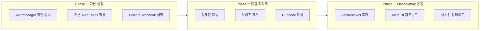

# Alerting Implementation Plan

> 단일 운영자 기준 K3s 클러스터를 위한 알람 시스템 구축 계획

## 1. 현재 상태

| 컴포넌트 | 상태 | 비고 |
|---------|------|------|
| Prometheus | ✅ 설치됨 | `monitoring` namespace |
| Grafana | ✅ 설치됨 | `monitoring` namespace |
| Alertmanager | ❓ 확인 필요 | kube-prometheus-stack 포함 여부 |
| Alert Rules | ❌ 미설정 | |
| Notification | ❌ 미설정 | |

## 2. 설계 원칙

### 2.1 단일 운영자 환경 고려사항

1. **노이즈 최소화**: 알람 피로도를 줄이기 위해 actionable한 알람만 설정
2. **즉시 조치 가능**: 알람을 받았을 때 바로 조치할 수 있는 정보 포함
3. **단계적 심각도**: Critical → Warning → Info 3단계로 구분
4. **자동 복구 대기**: 일시적 스파이크에 반응하지 않도록 적절한 `for` 지속시간 설정

### 2.2 알람 카테고리

```
┌─────────────────────────────────────────────────────────────┐
│                    Alert Categories                         │
├─────────────────────────────────────────────────────────────┤
│  🔴 Critical (즉시 대응)                                     │
│    - 서비스 다운                                             │
│    - 노드 NotReady                                          │
│    - 디스크 90% 이상                                         │
├─────────────────────────────────────────────────────────────┤
│  🟡 Warning (주의 필요)                                      │
│    - Pod 재시작 반복                                         │
│    - 메모리 80% 이상                                         │
│    - Argo CD Sync 실패                                      │
│    - GitHub Actions 빌드 실패                                │
├─────────────────────────────────────────────────────────────┤
│  🔵 Info (정보성)                                            │
│    - 배포 완료                                               │
│    - 새 Pod 스케줄링                                         │
└─────────────────────────────────────────────────────────────┘
```

## 3. 알람 규칙 상세

### 3.1 Infrastructure Alerts

```yaml
# prometheus-rules-infrastructure.yaml
apiVersion: monitoring.coreos.com/v1
kind: PrometheusRule
metadata:
  name: infrastructure-alerts
  namespace: monitoring
spec:
  groups:
    - name: node
      rules:
        - alert: NodeNotReady
          expr: kube_node_status_condition{condition="Ready",status="true"} == 0
          for: 5m
          labels:
            severity: critical
          annotations:
            summary: "Node {{ $labels.node }} is not ready"
            description: "Node has been unready for more than 5 minutes"
            runbook: "SSH into node and check kubelet status"

        - alert: NodeHighMemoryUsage
          expr: (1 - node_memory_MemAvailable_bytes / node_memory_MemTotal_bytes) * 100 > 80
          for: 10m
          labels:
            severity: warning
          annotations:
            summary: "High memory usage on {{ $labels.instance }}"
            description: "Memory usage is above 80% (current: {{ $value | printf \"%.1f\" }}%)"

        - alert: NodeDiskSpaceLow
          expr: (1 - node_filesystem_avail_bytes{mountpoint="/"} / node_filesystem_size_bytes{mountpoint="/"}) * 100 > 85
          for: 5m
          labels:
            severity: warning
          annotations:
            summary: "Disk space low on {{ $labels.instance }}"
            description: "Root filesystem usage is above 85%"

        - alert: NodeDiskSpaceCritical
          expr: (1 - node_filesystem_avail_bytes{mountpoint="/"} / node_filesystem_size_bytes{mountpoint="/"}) * 100 > 95
          for: 2m
          labels:
            severity: critical
          annotations:
            summary: "Disk space critical on {{ $labels.instance }}"
            description: "Root filesystem usage is above 95% - immediate action required"
```

### 3.2 Application Alerts

```yaml
# prometheus-rules-application.yaml
apiVersion: monitoring.coreos.com/v1
kind: PrometheusRule
metadata:
  name: application-alerts
  namespace: monitoring
spec:
  groups:
    - name: swkoo-apps
      rules:
        - alert: PodCrashLooping
          expr: rate(kube_pod_container_status_restarts_total{namespace="swkoo"}[15m]) > 0
          for: 5m
          labels:
            severity: warning
          annotations:
            summary: "Pod {{ $labels.pod }} is crash looping"
            description: "Pod has restarted {{ $value | printf \"%.0f\" }} times in the last 15 minutes"

        - alert: PodNotReady
          expr: kube_pod_status_ready{namespace="swkoo", condition="true"} == 0
          for: 5m
          labels:
            severity: warning
          annotations:
            summary: "Pod {{ $labels.pod }} is not ready"
            description: "Pod has been in non-ready state for 5 minutes"

        - alert: DeploymentReplicasMismatch
          expr: kube_deployment_status_replicas_available{namespace="swkoo"} != kube_deployment_spec_replicas{namespace="swkoo"}
          for: 10m
          labels:
            severity: warning
          annotations:
            summary: "Deployment {{ $labels.deployment }} replica mismatch"
            description: "Deployment has {{ $value }} available replicas, expected {{ $labels.replicas }}"

        - alert: ServiceEndpointDown
          expr: kube_endpoint_address_available{namespace="swkoo"} == 0
          for: 2m
          labels:
            severity: critical
          annotations:
            summary: "Service {{ $labels.endpoint }} has no available endpoints"
            description: "All endpoints are down for service"
```

### 3.3 GitOps Alerts

```yaml
# prometheus-rules-gitops.yaml
apiVersion: monitoring.coreos.com/v1
kind: PrometheusRule
metadata:
  name: gitops-alerts
  namespace: monitoring
spec:
  groups:
    - name: argocd
      rules:
        - alert: ArgoCDAppOutOfSync
          expr: argocd_app_info{sync_status!="Synced"} == 1
          for: 15m
          labels:
            severity: warning
          annotations:
            summary: "Argo CD app {{ $labels.name }} is out of sync"
            description: "Application has been out of sync for more than 15 minutes"

        - alert: ArgoCDAppUnhealthy
          expr: argocd_app_info{health_status!="Healthy"} == 1
          for: 10m
          labels:
            severity: warning
          annotations:
            summary: "Argo CD app {{ $labels.name }} is unhealthy"
            description: "Application health status: {{ $labels.health_status }}"

        - alert: ArgoCDSyncFailed
          expr: argocd_app_sync_status{sync_status="Failed"} == 1
          for: 1m
          labels:
            severity: critical
          annotations:
            summary: "Argo CD sync failed for {{ $labels.name }}"
            description: "Manual intervention may be required"
```

## 4. 알림 채널 설정

### 4.1 Alertmanager 설정

```yaml
# alertmanager-config.yaml
apiVersion: v1
kind: Secret
metadata:
  name: alertmanager-main
  namespace: monitoring
stringData:
  alertmanager.yaml: |
    global:
      resolve_timeout: 5m
      
    route:
      group_by: ['alertname', 'severity']
      group_wait: 30s
      group_interval: 5m
      repeat_interval: 4h
      receiver: 'default'
      routes:
        - match:
            severity: critical
          receiver: 'critical-alerts'
          repeat_interval: 1h
        - match:
            severity: warning
          receiver: 'warning-alerts'
          repeat_interval: 4h

    receivers:
      - name: 'default'
        # Slack or Discord webhook (TBD)
        
      - name: 'critical-alerts'
        # 즉시 알림: Email + Mobile Push
        email_configs:
          - to: 'sungwookoo.dev@gmail.com'
            send_resolved: true
            
      - name: 'warning-alerts'
        # 일반 알림: Slack/Discord only
        
    inhibit_rules:
      - source_match:
          severity: 'critical'
        target_match:
          severity: 'warning'
        equal: ['alertname', 'namespace']
```

### 4.2 알림 채널 옵션 비교

| 채널 | 장점 | 단점 | 적합도 |
|------|------|------|--------|
| **Email** | 안정적, 기록 보관 | 즉시성 낮음 | Critical용 백업 |
| **Slack** | 실시간, 팀 협업 | 유료(히스토리) | ⭐ 추천 |
| **Discord** | 무료, Webhook 간편 | 비업무용 이미지 | 개인 프로젝트 적합 |
| **Telegram** | 무료, 모바일 즉시 | 봇 설정 필요 | 모바일 알림용 |
| **PagerDuty** | On-call 로테이션 | 비용, 1인 불필요 | ❌ 과도함 |

**권장 구성 (단일 운영자)**:
- Critical: Discord + Email
- Warning: Discord only
- Info: Grafana Dashboard only (알림 없음)

## 5. Observatory 연동 계획

### 5.1 알람 상태 표시

Observatory UI에 현재 활성화된 알람을 표시:

```
┌────────────────────────────────────────────────────────┐
│  🚨 Active Alerts (2)                                  │
├────────────────────────────────────────────────────────┤
│  🔴 [Critical] NodeDiskSpaceCritical                   │
│     Node: k3s-master • Since: 10 min ago               │
├────────────────────────────────────────────────────────┤
│  🟡 [Warning] ArgoCDAppOutOfSync                       │
│     App: swkoo-frontend • Since: 25 min ago            │
└────────────────────────────────────────────────────────┘
```

### 5.2 구현 단계



## 6. 구현 태스크 목록

### Phase 1: 기본 설정 (1-2일)

- [ ] `kubectl get pods -n monitoring` 으로 Alertmanager 설치 여부 확인
- [ ] Alertmanager 미설치 시 kube-prometheus-stack 업그레이드
- [ ] Discord 서버 생성 및 Webhook URL 발급
- [ ] `prometheus-rules-infrastructure.yaml` 적용
- [ ] `prometheus-rules-application.yaml` 적용
- [ ] Alertmanager 설정 적용 및 테스트 알람 발송

### Phase 2: 알람 최적화 (3-5일)

- [ ] 실제 메트릭 기반 임계값 조정 (Grafana로 현재 값 확인)
- [ ] 불필요한 알람 필터링 규칙 추가
- [ ] 각 알람별 Runbook 문서 작성 (docs/runbooks/)
- [ ] Silence 규칙 설정 (계획된 유지보수용)

### Phase 3: Observatory 연동 (2-3일)

- [ ] Backend: `/api/alerts` 엔드포인트 추가
- [ ] Alertmanager API 클라이언트 구현
- [ ] Frontend: `AlertList` 컴포넌트 개발
- [ ] Observatory 페이지에 알람 섹션 추가
- [ ] (Optional) SSE로 실시간 알람 푸시

## 7. 예상 리소스 영향

| 컴포넌트 | 추가 리소스 | 비고 |
|---------|------------|------|
| Alertmanager | ~50MB RAM | 이미 설치되어 있다면 0 |
| Alert Rules 평가 | ~5% CPU | Prometheus 부하 |
| Discord Webhook | 네트워크만 | 무료 |

## 8. Trade-offs 및 결정 근거

### 왜 지금 알람이 없는가?

1. **우선순위 조정**: MVP 단계에서는 파이프라인 시각화에 집중
2. **노이즈 vs 신뢰도**: 부정확한 알람보다 없는 것이 나음
3. **리소스 제약**: 단일 노드 환경에서 모니터링 스택 경량화 필요

### 왜 PagerDuty/OpsGenie가 아닌가?

- 단일 운영자 환경에서 On-call 로테이션 불필요
- 비용 대비 가치 낮음
- Discord + Email로 충분한 커버리지

### 왜 Email만 사용하지 않는가?

- 즉시성 부족 (이메일 확인 지연)
- 모바일 푸시 알림이 더 효과적
- Discord는 무료 + 히스토리 무제한 + 모바일 앱 지원

---

**다음 단계**: Phase 1 구현을 시작하려면 먼저 `kubectl get pods -n monitoring`으로 현재 Alertmanager 설치 상태를 확인해주세요.

